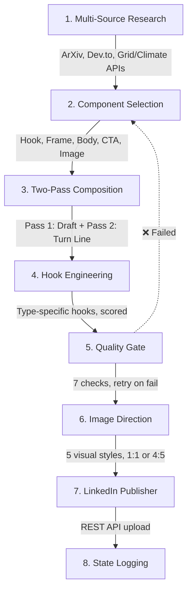

# EcoPulse LinkedIn Engine (v3.2)

> **Note:** `script.py` is the canonical production pipeline for this repository. It runs natively via GitHub Actions.

# EcoPulse LinkedIn Engine v5.0 — Viral Post Framework 🚀

Autonomous **config-driven** pipeline that researches topics, selects modular post components, composes high-converting LinkedIn posts through a two-pass Gemini pipeline, generates matched visuals, and publishes — with built-in quality gates and variety enforcement.

---

## 🧬 Core Architecture: Modularity Over Templates

Each post is assembled from **independently selected components**:

```
POST = HOOK + FRAME + BODY_STRUCTURE + PROOF + TURN + CTA + IMAGE_STYLE
```

Components are picked per-post based on source type, data availability, and variety constraints. A rolling `used_post_combinations.json` tracks the last 15 posts to prevent repetitive content.

---

## 🔄 8-Phase Pipeline



---

## 📋 Component Menus

### Hook Types (8 styles)
`contrarian` · `confession` · `number_shock` · `direct_address` · `story_cold_open` · `question_trap` · `pattern_interrupt` · `curiosity_gap`

### Framings (7 lenses)
`narrative` · `industry_observation` · `data_breakdown` · `myth_bust` · `framework_howto` · `prediction` · `case_study`

### Body Structures (5 patterns)
`A` Problem→Insight→Reframe · `B` Before→After→Bridge · `C` List-with-a-twist · `D` Story→Lesson→Truth · `E` Data Deep-Dive

### CTA Types (5 approaches)
`soft_mirror` · `specific_ask` · `value_forward` · `silent` · `save_bait`

### Image Styles (5 visuals)
`text_on_card` · `data_visual` · `diagram_framework` · `editorial_illustration` · `before_after_split`

### Length Presets
`punch` (50–90 words) · `standard` (150–250 words) · `deep` (300–450 words)

---

## 🛡️ Quality Gate (8 Checks)

Before publishing, every post is evaluated against:

1. **Specificity** — at least one concrete number, name, or fact
2. **Hook Strength** — scored 1–10, rejected below 6
3. **Repetition** — no repeated (hook+body) combo in last 5 posts
4. **Cliché Filter** — rejects burned-out phrases, emoji-as-bullets, hashtag walls
5. **Turn Line** — verifies one quotable standalone sentence exists
6. **Image-Text Match** — verifies visual style aligns with post content
7. **Length Bounds** — ensures word count is within 15% of the selected length preset
8. **Carousel Bounds** — ensures 7–12 slides with ≤55 words per slide (when carousel format is selected)

Failed posts trigger a retry with fresh component selection (max 3 attempts).

---

## 🎨 Image Generation

| Style | Aspect | Rendering |
|---|---|---|
| Text-on-Card | 1:1 (1080×1080) | Playwright HTML template |
| Data Visual | 1:1 (1080×1080) | Playwright HTML template |
| Diagram/Framework | 4:5 (1080×1350) | Playwright HTML template |
| Editorial Illustration | 1:1 (1080×1080) | Gemini native image gen |
| Before/After Split | 1:1 (1080×1080) | Playwright HTML template |

Images reinforce the **Turn line**, not the whole post. No generic stock-photo tropes.

---

## 🛠️ Setup & Secrets

Set the following in **Settings → Secrets and variables → Actions**:

| Secret Name | Description |
|---|---|
| `GEMINI_API_KEY` | Gemini API key for text & image generation |
| `LINKEDIN_ACCESS_TOKEN` | OAuth2 Access Token with `w_member_social` scope |
| `LINKEDIN_PERSON_URN` | Member URN, format: `urn:li:person:XXXXXXXX` |

---

## 🧪 Local Dry-Run

```bash
pip install -r requirements.txt
python -m playwright install chromium
export ECOPULSE_DRY_RUN=true
python engine.py
```

---

## 📂 Project Structure

```
engine.py                          # Main 8-phase orchestrator
src/
  post_config.py                   # Component enums & PostConfig dataclass
  combination_tracker.py           # Rolling variety enforcement
  editorial_engine.py              # Two-pass Gemini post composer
  hook_engine.py                   # Type-specific hook generation & scoring
  review_engine.py                 # Quality gate evaluator (7 checks)
  image_director.py                # Multi-style visual generator
  research_engine.py               # Multi-source research (ArXiv, Dev.to, APIs)
  memory_engine.py                 # State management & duplicate prevention
  gemini_client.py                 # Gemini API client with model fallback
  publisher.py                     # LinkedIn REST API publisher
  templates/
    text_on_card.html/.css         # Quote card template
    data_visual.html/.css          # Stat card template
    diagram_framework.html/.css    # Flow diagram template
    before_after_split.html/.css   # Two-panel comparison template
    meme_board.html/.css           # Legacy visual templates
state/
  posted_log.json                  # Published post history
  used_post_combinations.json      # Rolling component combination log
```
